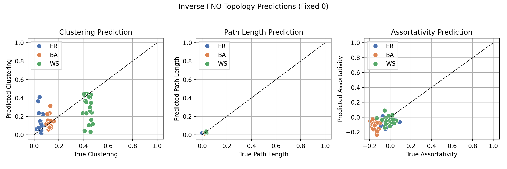
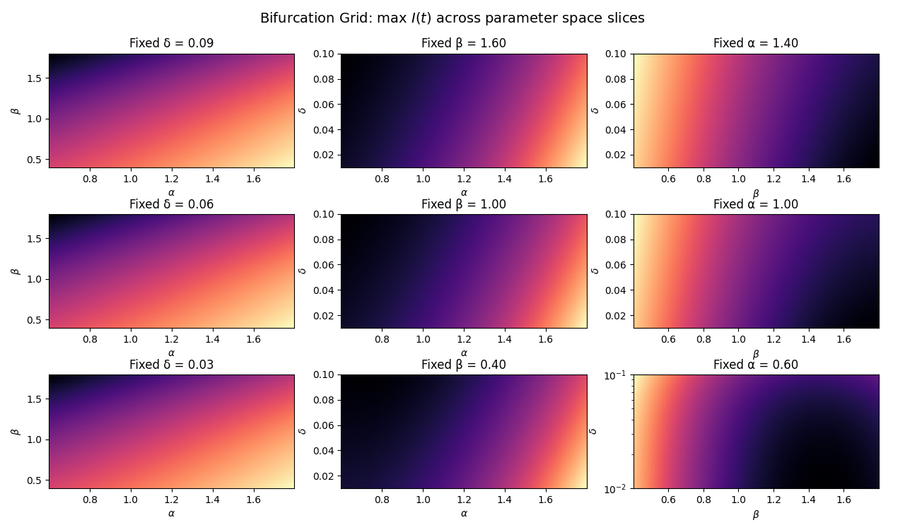

# 🧠 Rumor Propagation with Modular Fourier Neural Operators

A modular, PyTorch-powered sandbox for simulating and learning **rumor dynamics** over networks using **Fourier Neural Operators (FNOs)**. Built to explore how rumors spread—and what they might reveal about the structure of the network beneath.

> This is experimental research code, built quickly, and subject to revision. Use responsibly.

## 🚀 What This Repo Supports

- ✅ Forward simulations of rumor spread (Dong, SIR, Topo-based models)
- 🔁 Inverse learning to recover model parameters from observed dynamics
- 📈 Bifurcation and sensitivity analysis with precomputed heatmaps
- 🧠 Inference of network **topological features** (clustering, path length) from observed trajectories
- 📊 Clean CLI + script interfaces for all training and evaluation routines
- 🔌 Drop-in modular support for defining new models

---

## 📂 Repository Structure

```
rumor_spread/
├── dynamics/               # All pluggable simulation models
├── models/                 # FNO and spectral conv blocks
├── utils/                  # Dataset generation helpers
├── scripts/                # CLI-ready trainers and visualizers
├── run_pipeline.py         # Unified entrypoint
├── inference.py            # Inference wrapper
├── figures/, checkpoints/, plots/  # Output
```

---

## 🧬 Simulation Models

Each model implements:
```python
.simulate(params, T, dt)
.parameter_dim()
.state_dim()
```

- **DongRumorModel** – rumor propogation model on homogeneous network with varying (logistic) population size, as proposed by Dong et. al (2018).
- **SIRModel** –  Rumor Spreading epidemic simulation on a given network topology.
- **TopoRumorModel** – SIRModel which includes topology-dependent outputs (clustering, etc.)

---

## 🧠 Learning Tasks


*FNO predictions closely track ground truth over ER, BA, WS networks, demonstrating generalization.*

### ➤ Forward Learning
Learn \( u(t) \) from model parameters \( \theta = (\beta, \alpha, \delta, i_0) \)
```bash
python run_pipeline.py train_forward --epochs 100
```

<div align="center">
  
  <p style="font-size:small">FNO predictions vs. ground truth across ER, BA, WS networks</p>
</div>

### ➤ Inverse Learning
Recover \( \theta \) from trajectories
```bash
python run_pipeline.py train_inverse --epochs 100
```

### ➤ Topology Inference (Exploratory)
Predict clustering/path length/assortativity from rumor dynamics


*Clustering and path length show recoverable structure from observed dynamics; assortativity remains harder.*

```bash
python scripts/train_topology_inverse.py
python scripts/visualize_topology_inverse.py --samples 30
```

<div align="center">
  
  <p style="font-size:small">Inverse FNO recovering topological descriptors from observed system dynamics</p>
</div>

---


*Bifurcation surfaces generated across parameter sweeps — highlighting nonlinear transitions.*

## 📈 Bifurcation & Parameter Sensitivity

This system explores parameter interactions across large sweeps.

<div align="center">
  
  <p style="font-size:small">Bifurcation surfaces computed for combinations of α, β, δ</p>
</div>

---

## 📊 Requirements
```bash
pip install -r requirements.txt
```
- Python ≥ 3.10
- PyTorch ≥ 1.12
- matplotlib, numpy, tqdm, seaborn, networkx

---

## 🤔 Who Should Use This?

- ML folks playing with neural operators
- Network scientists modeling spread phenomena
- People curious about how topology affects emergent dynamics
- Anyone looking to test FNOs on weird, real-world inspired simulations
- People who enjoy sushi

---

## 📜 License

MIT — do your thing.

---

## 👨‍💻 Author

**Jacob Briones**  
*Dad. Math undergrad. Writes models and diapers. *

